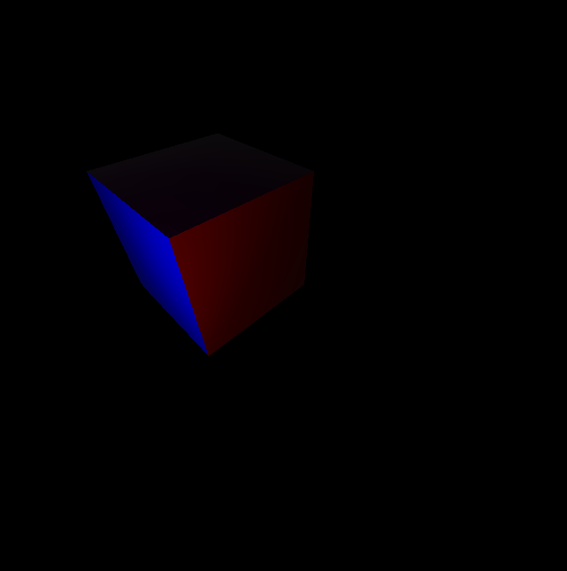
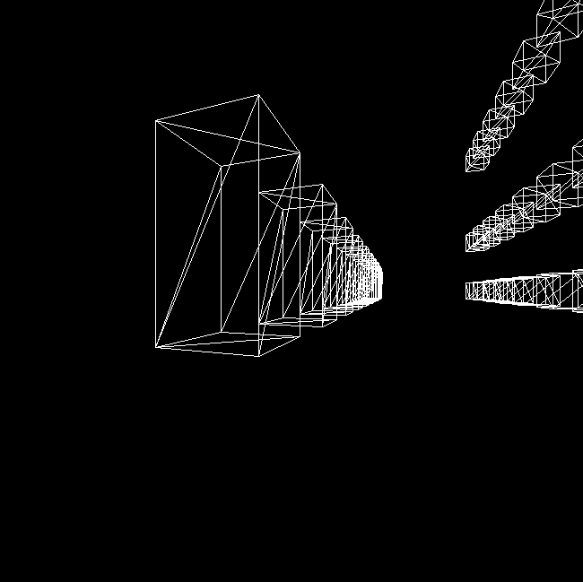

<h1>SoftwareRenderer</h1>

Software renderer I wrote in Java for one of my university courses

<table>
    <tr>
        <td></td>
        <td></td>
    </tr>
    <tr>
        <td></td>
        <td></td>
      </tr>
    <tr>
        <td></td>
    </tr>
</table>

<h2>Features</h2>
<ul>
    <li>Line and 3D object drawing with colored vertices</li>
    <li>Line antialiasing</li>
    <li>Multiple shading models including flat, gouraud, and phong</li>
    <li>Scene and model loading from custom format and .obj files respectively</li>
    <li>Orthographic and perspective cameras</li>
    <li>Optimizations through z-buffering and frustum culling</li>
</ul>

<h2>System Requirements</h2>
<ul>
    <li>OS: Windows 32/64 bit</li>
    <li>Memory: Minimum 1GB</li>
    <li>Java 8</li>
</ul>
